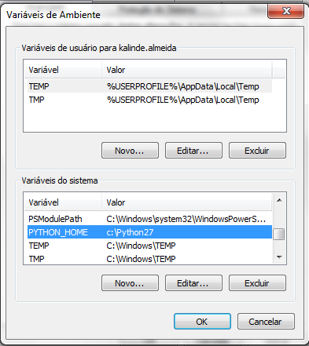
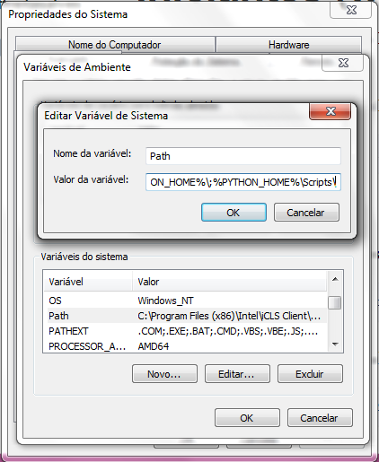

## Configuração do ambiente Windows


# Windows:

- GIT (https://git-scm.com/download/win)

- Python 2.7.9, download: (https://www.python.org/ftp/python/2.7.9/python-2.7.9.msi)

- Configurar variavel de ambiente PYTHON_HOME para o endereço de instalação, normalmente para windows é usado o caminho c:\Python27 para a instalação (Link sobre configurações de variaveis de ambiente no Windows https://technet.microsoft.com/pt-br/library/cc668471.aspx)



- Adicionar na variavel Path o seguinte texto: ;%PYTHON_HOME%\;%PYTHON_HOME%\Scripts\ :




- Para testar a configuração basta abrir um novo terminal e digitar os seguintes comandos abaixos:


Testar comando python:
```shell
    python --version
```
Saida para o comando python deve ser algo parecido com:
```shell
	Python 2.7.9
```
Testar o comando pip:
```shell
    pip --version
```
Saida para o comando pip deve ser algo parecido com:
```shell
	pip 1.5.6 from C:\Python27\lib\site-packages (python 2.7)
```


- virtualenv (tutorial para instalação em windows: https://fernandofreitasalves.com/tutorial-virtualenv-para-iniciantes-windows/)


## Criando o ambiente

```shell
    virtualenv ENV
```

## Configurando o shell para ambiente virtual

```shell
    source ENV/bin/activate
```

## Baixando as dependencias

```shell
    pip install -r requirements.txt
```

## Executando o app

```shell
    ./ENV/bin/python src/app.py
```